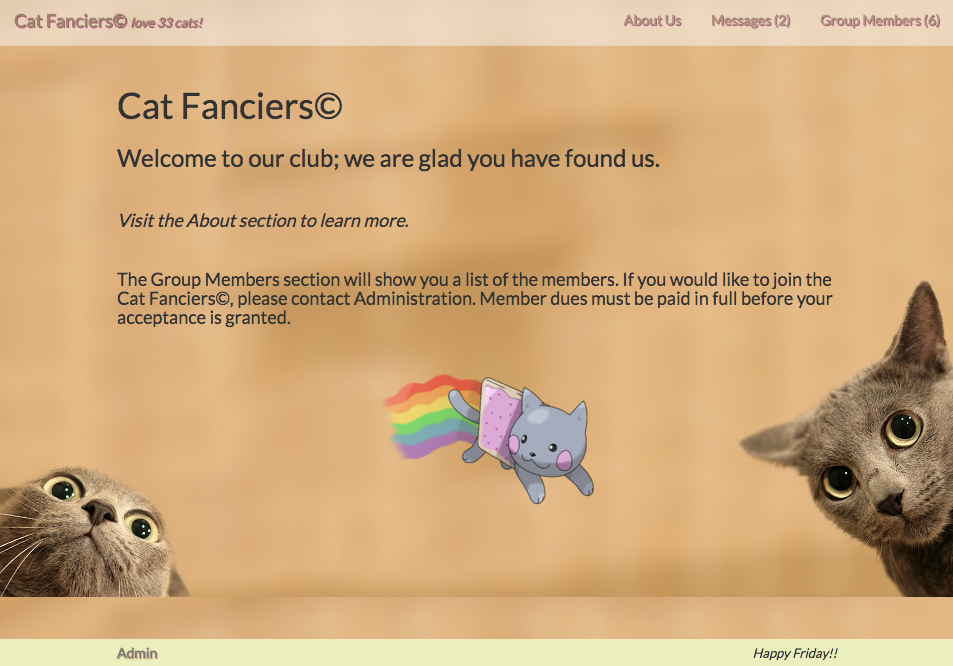

# Cat Fanciers

_Angular Extended JS Independent Project for Epicodus, 08.25.2017_

By _Calla Rudolph_ [(e-mail me here)](<mailto:callarudolph@gmail.com>)

This website has been deployed for easy viewing: https://cat-fanciers.firebaseapp.com

## Description

This Angular 2 app was created as a portal for members to belong to the Cat Fanciers group. The app keeps a directory of all members by utilizing Firebase.
  * Members are stored with their name, bio, number of cats owned, a picture, and location.
  * Each member's profile can be viewed through a dynamic route.
  * The admin section allows for new members to be entered, and each member can be individually edited or deleted, with changes saved directly to Firebase and immediately viewable on the page.
  * There is a Messages component for users to leave and delete messages.
  * A counter on the navbar displays the total number of members, messages, and cats that the members own. The footer displays the current day of the week.

_***Take a look at planning.md to see the foundation for this app!***_

_This project was generated with [Angular CLI](https://github.com/angular/angular-cli) version 1.0.0._


_This image is a screenshot of the Group Members component_

## Prerequisites

You will need the following things properly installed on your computer:
* [Git](https://git-scm.com/)
* [Node.js](https://nodejs.org/) (with NPM)
* [Angular](https://cli.angular.io/) (in Terminal: $ npm install -g @angular/cli@1.0.0)
* [TypeScript](https://www.typescriptlang.org/) (from NPM in Terminal: $ npm install typescript -g)
* [Bower](https://bower.io/)
* You will need Firebase to clone this project. Make a free account at [Firebase](https://firebase.google.com/)
  * Once logged in to Firebase, select `Create a New Project` and give the project a name.
  * In the Overview section, select `Add Firebase to your web app`. Keep this modal handy for use in just a moment.

## Installation

* Open Github site in your browser: https://github.com/CallaRudolph/cat-fanciers
* Select green drop-down box to Clone or Download
* Open Terminal on your computer and follow these steps:
  * `$ cd desktop`
  * `$ git clone <paste repository-url>`
  * `$ cd cat-fanciers`
  * `$ npm install`
  * `$ bower install`
  * `$ ng build`
  * `$ touch src/app/api-keys.ts`
* In your text editor, go to the api-keys file you just made, and paste in this information:
  ````
  export var masterFirebaseConfig = {
    apiKey: "xxxx",
    authDomain: "xxxx.firebaseapp.com",
    databaseURL: "https://xxxx.firebaseio.com",
    storageBucket: "xxxx.appspot.com",
    messagingSenderId: "xxxx"
  };
  ````
* Return to the Firebase modal, copy your project information, and paste the corresponding info into the `xxxx` spaces in the api-keys file. Your file should have your specific Firebase credentials and other information here, instead of `xxxx`.

## Development server

Run `ng serve` for a dev server. Navigate to `http://localhost:4200/` in your browser. The app will automatically reload if you change any of the source files.

## Technologies Used

Angular 2 CLI, Firebase, TypeScript, Node.js, Bower, Bootstrap, CSS, HTML

## License

Copyright &copy; 2017 Calla Rudolph

_Please email me at the above address with any comments or improvements you have found!_

This software is licensed under the MIT license.
______________________________________

## Code scaffolding

Run `ng generate component component-name` to generate a new component. You can also use `ng generate directive/pipe/service/class/module`.

## Build

Run `ng build` to build the project. The build artifacts will be stored in the `dist/` directory. Use the `-prod` flag for a production build.

## Running unit tests

Run `ng test` to execute the unit tests via [Karma](https://karma-runner.github.io).

## Running end-to-end tests

Run `ng e2e` to execute the end-to-end tests via [Protractor](http://www.protractortest.org/).
Before running the tests make sure you are serving the app via `ng serve`.

## Further help

To get more help on the Angular CLI use `ng help` or go check out the [Angular CLI README](https://github.com/angular/angular-cli/blob/master/README.md).
